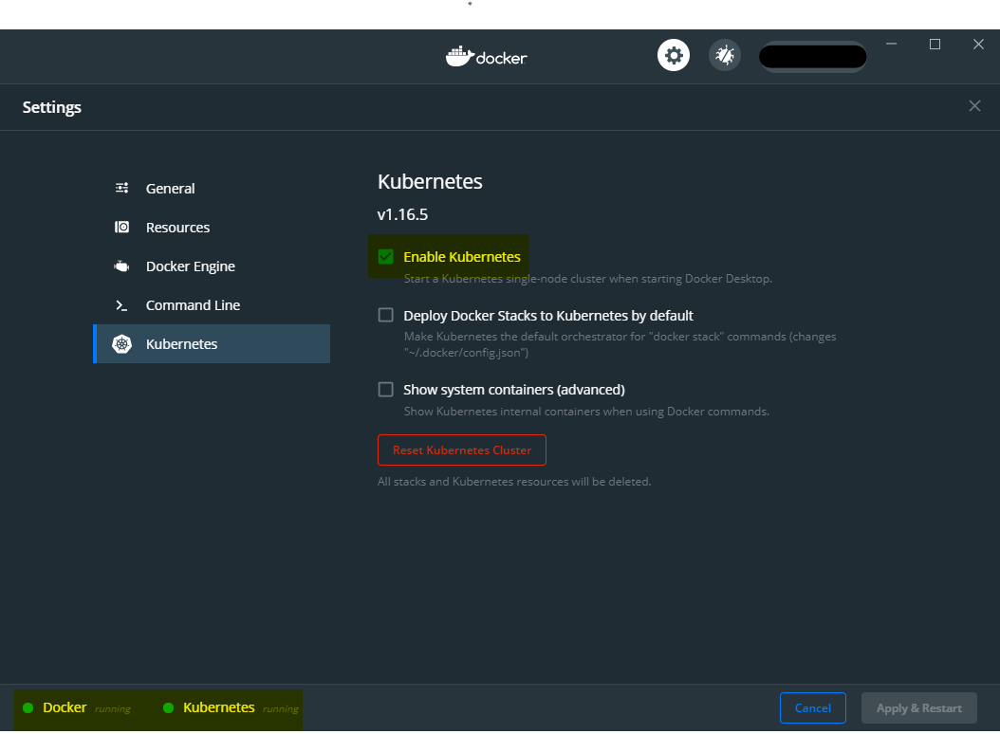

# Web2_Projekat

This is a school project for Web course in Faculty of Technical Sciences - University of Novi Sad.

Authors:

- [Student 1](https://github.com/SrdjanStankov/Web2_Projekat/wiki/Student-1): [Danilo Novaković](https://github.com/DaniloNovakovic)
- [Student 2](https://github.com/SrdjanStankov/Web2_Projekat/wiki/Student-2): [Srđan Stankov](https://github.com/SrdjanStankov)

## Getting Started

### Prerequisites

You will need the following tools:

- [Visual Studio 2017-2019](https://www.visualstudio.com/downloads/)
- [.NET Core SDK 3.1](https://www.microsoft.com/net/download/dotnet-core/3.1)
- [NPM](https://nodejs.org/en/)
- [Docker Desktop](https://www.docker.com/products/docker-desktop)

### Setup

Follow these steps to get your development environment set up:

  1. Make sure that Docker Desktop is running
  2. Make sure that Kubernetes is running in Docker Desktop Dashboard
  
  1. Clone the repository
  1. Go to `PUSGS_Project/ClientApp` directory and run: `npm install`
  1. Build solution in Visual Studio (2017 or 2019)
  4. Run: `PUSGS_Project/Setup.bat`

### Configuration

Due to possible security difficulties of sending email to gmail from `localhost` during development, [additional steps](https://support.google.com/accounts/answer/185833) are required to make sure you get email service working.

For this reason we have added properties which you can modify in `PUSGS_Project/k8s/api-deployment.yaml` as explained below.

```yaml
  /* used for jwt authorization */
  - name: ApplicationSettings__JWT_Secret
    value: "...", 

  /* used when creating redirect href link in email */
  - name: ApplicationSettings__Client_URL
    value: "http://localhost:4200"

  /* if true user can't login until he verifies email */
  - name: ApplicationSettings__RequireEmailVerification
    value: "true"

  /* your email */
  - name: ApplicationSettings__NetworkCredentialUsername
    value: "...@gmail.com"

  /* password generated when you link gmail with local machine (2-step-verification) */
  - name: ApplicationSettings__NetworkCredentialPassword
    value: "..."

  /* if true all emails will be redirected to your email (great for development) */
  - name: ApplicationSettings__RedirectEmailToCredentialUsername
    value: "true"

  /* client host (smtp.gmail.com for gmail) */
  - name: ApplicationSettings__SmtpClientHost
    value: "smtp.gmail.com"

  /* port for your smtp client (ex. 587 or 25) */
  - name: ApplicationSettings__SmtpClientPort
    value: "587"

  /* if true reservation invites/accept notifications will be sent via email */
  - name: ApplicationSettings__SendEmailNotifications
    value: "true"
```

## Doc

Project specification (currently only available in Serbian language) can be found [here](./doc/specifikacija.md) (or [here](./doc/specifikacija2.pdf) (pdf))
